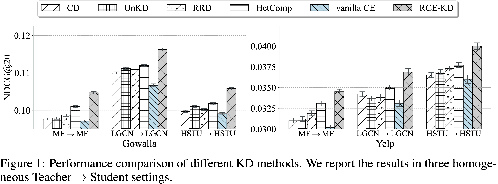
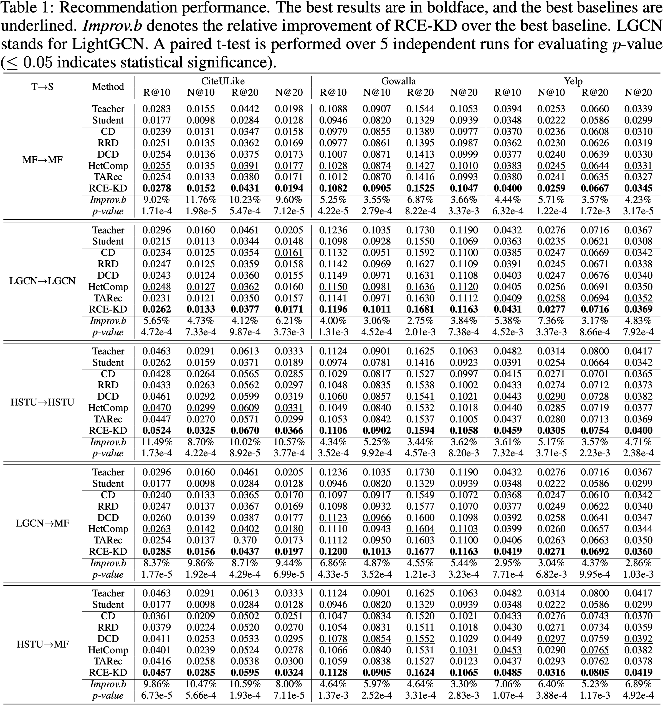
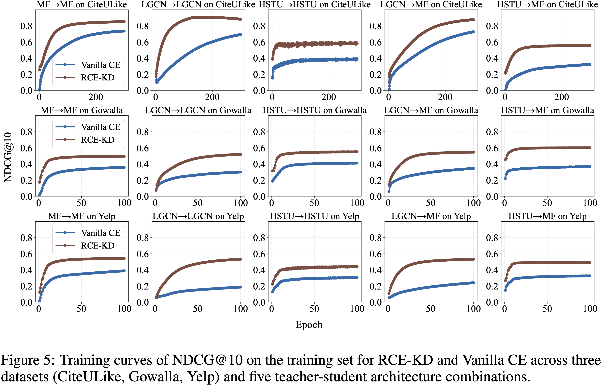
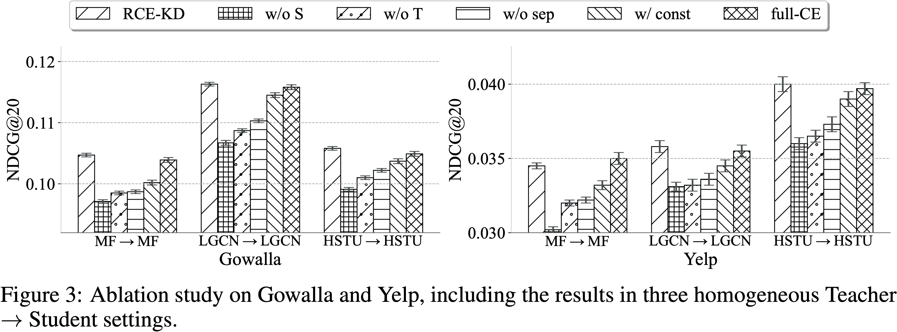

# Rejuvenating Cross-Entropy Loss in Knowledge Distillation for Recommender Systems

This repo provides the Pytorch codes for RCE-KD.

## 📝 Abstract

This paper analyzes Cross-Entropy (CE) loss in knowledge distillation (KD) for recommender systems. KD for recommender systems targets at distilling rankings, especially among items most likely to be preferred, and can only be computed on a small subset of items. Considering these features, we reveal the connection between CE loss and NDCG in the field of KD. We prove that when performing KD on an item subset, minimizing CE loss maximizes the lower bound of NDCG, only if an assumption of closure is satisfied. It requires that the item subset consists of the student's top items. However, this contradicts our goal of distilling rankings of the teacher's top items. We empirically demonstrate the vast gap between these two kinds of top items. To bridge the gap between our goal and theoretical support, we propose **R**ejuvenated **C**ross-**E**ntropy for **K**nowledge **D**istillation (RCE-KD). It splits the top items given by the teacher into two subsets based on whether they are highly ranked by the student. For the subset that defies the condition, a sampling strategy is devised to use teacher-student collaboration to approximate our assumption of closure. We also combine the losses on the two subsets adaptively.

## 📊 Experimental Results









## ⚙️ Requirement

1. Create the conda environment with `Python==3.9.21`.
2. Install pytorch using the following code:

   ```shell
   pip install torch==2.4.1 torchvision==0.19.1 torchaudio==2.4.1 --index-url https://download.pytorch.org/whl/cu124
   ```
3. Install other packages using `requirements.py`:

   ```bash
   pip install -r requirements.py
   ```

## 🧩 Data

Details about the datasets and download links are provided in the `README` files located within each dataset folder, such as, `./data/gowalla/README`.

For all datasets, you must first download the files from the links provided in the README files, extract them, and place them in the corresponding dataset folder.

Note that, for CiteULike dataset, preprocessing is required. Please follow the codes below.

```bash
cd data/citeulike
python preprocess_citeulike.py
cd ../..
```

For other datasets, no further preprocessing is required.

## 🚀 Usage

1. First, you need to train the teacher. For example,

   ```shell
   python -u main.py --dataset=citeulike --S_backbone=bpr --train_teacher --suffix teacher
   ```

   You can replace "citeulike" with "gowalla" and "yelp" to test on your interested dataset.

   You can also set "`--S_backbone=lightgcn`" or "`--S_backbone=hstu`".
2. Now, you can start knowledge distillation. For example,

   ```shell
   python -u main.py --dataset=citeulike --S_backbone=bpr --T_backbone=bpr --model=rcekd
   ```

   By configuring the "`--model`" option, you can test other KD methods, such as rrd.

We provide some exemplar command lines in `run.sh`.

## 🗒️ Notes

In `configs/`, we have provided the configuration of hyperparameters for RCE-KD, together with hyperparameters for other compared methods.

In `modeling/KD/baseline.py`, we provide the codes for all baseline methods.

The code for RCE-KD is given in `modeling/KD/playground.py`.

The codes for all backbones are provided in `modeling/backbone/`.

## 📜 Citation

```
@article{zhu2025rejuvenating,
  title={Rejuvenating Cross-Entropy Loss in Knowledge Distillation for Recommender Systems},
  author={Zhu, Zhangchi and Zhang, Wei},
  journal={arXiv preprint arXiv:2509.20989},
  year={2025}
}
```
